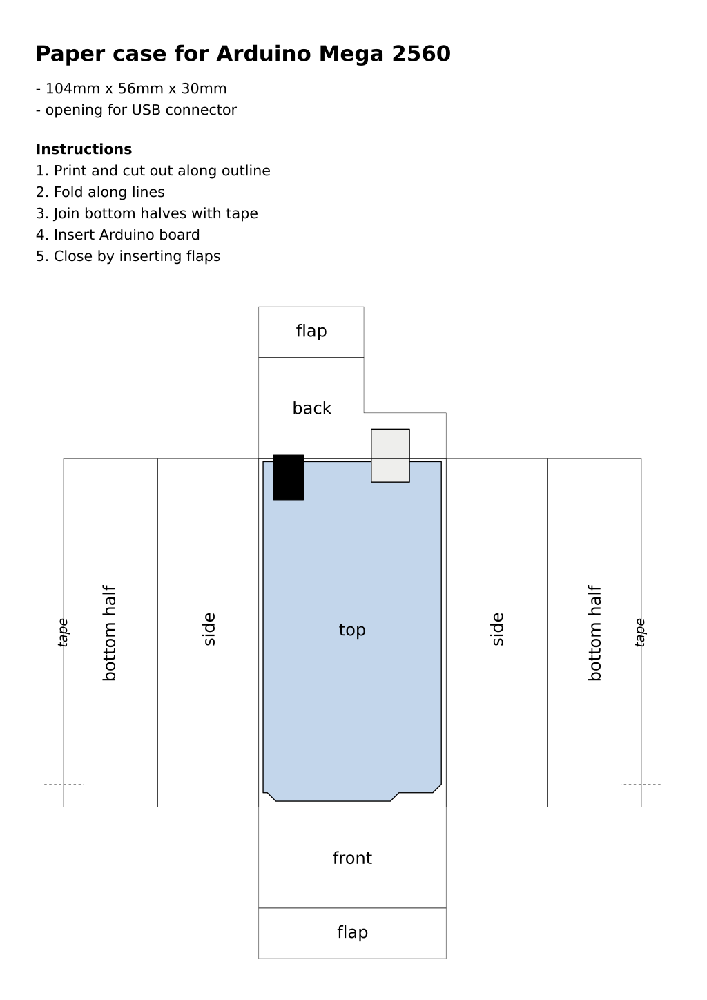

## Arduino Mega paper case

This is a cut-and-fold paper case for the Arduino Mega 2560 board. Check out the source SVG file for simple editing and printing on an A4 paper sheet.

The original measurements are based on [SVG board drawings by Wayne and Layne](http://www.wayneandlayne.com/blog/2010/12/19/nice-drawings-of-the-arduino-uno-and-mega-2560/), thanks a lot!

